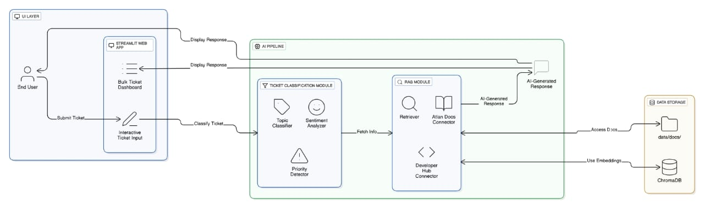

# Customer Support Copilot (Atlan AI Engineer Internship Task)

## 📌 Overview
This repository contains my submission for the **Atlan AI Engineering Internship Challenge**.  
The goal of this task was to build a **Customer Support Copilot** system that can handle ticket classification, knowledge retrieval, and provide a small assistant view for resolving queries.

The implementation demonstrates:  
- Bulk ticket classification with fallback heuristics.  
- A RAG-backed assistant that retrieves answers from ingested documentation.  
- Local persistence using Chroma DB.  
- A simple Streamlit UI for interaction.

---

## 🚀 Project Links & Live Demo

- **Live Application:** [Customer Support Copilot](https://atlan-customer-support-copilot.onrender.com)  
  Try the working helpdesk application directly in your browser.

- **GitHub Repository:** [Repo Link](https://github.com/Gupta-4388/atlan-customer-support-copilot)  
  Contains all source code, project files, and documentation.

---

## ⚙️ Features
- **Bulk Ticket Classification**: Classifies multiple tickets at once, with fallback heuristics if no OpenAI key is provided.  
- **RAG-backed Assistant**: Uses a retrieval-augmented generation flow to answer queries from ingested docs.  
- **Chroma DB Support**: Stores embeddings locally for efficient retrieval.  
- **Flexible Setup**: Works even without an OpenAI API key (heuristics only).  
- **Streamlit UI**: Simple web app interface for exploration.

---

## 🚀 Quick Start (Windows PowerShell)

1. Copy `.env.example` to `.env` and fill in `OPENAI_API_KEY` if available.  

2. Create and activate a virtual environment, then install requirements:

```powershell
python -m venv venv
venv\Scripts\activate
pip install -r requirements.txt
````

3. Confirm tickets load:

```powershell
python ingest.py --list
```

4. *(Optional)* Fetch documentation to `data/docs`:

```powershell
python ingest.py --fetch <urls>
```

5. Launch the Streamlit app:

```powershell
streamlit run app.py
```

---

## 📂 Project Structure

```
atlan-customer-support-copilot/

├── app.py                    # Streamlit app (UI)
├── ingest.py                 # Handles ticket/doc ingestion
├── classify.py               # Ticket classification logic (topic, sentiment, priority)
├── rag.py                    # RAG helper: answer_query using Chroma + GPT
├── data/
│   ├── chroma_db/            # Local Chroma DB persistence
│   ├── sample_tickets.jsonl  # Example support tickets
│   ├── docs/                 # Optional SDK/docs files for RAG
├── tests/
│   ├── test_ingest.py        # Test ingestion works (mock URLs)
│   ├── test_classify.py      # Test classification logic
├── .gitignore                # Ignore sensitive/auto-generated files
├── render.yaml               # Render deployment config
├── requirements.txt          # Dependencies
├── README.md                 # Project documentation
├── submission.md             # Submission summary
```

---

## 🏗️ System Architecture  

The following diagram illustrates the complete architecture of the **Customer Support Copilot AI System**, highlighting the flow from user interaction to AI-driven insights.  

  

---

## 🛠️ Design Decisions

1. **Fallback Heuristics:**
   Even without an OpenAI API key, the app still classifies tickets using rule-based heuristics.

2. **Local Persistence:**
   Chroma DB persistence ensures embeddings don’t need to be regenerated every run.

3. **Lightweight & Minimal:**
   No heavy dependencies are used outside of `requirements.txt`, making the app easy to run locally.

---

## 🔑 Key Learnings

* Practical use of RAG (Retrieval-Augmented Generation) in a support assistant.
* Trade-offs between heuristic classification and LLM-based classification.
* Best practices for structuring AI apps with a clean, documented repo.

---

## ✅ Task Completion Status

* ✅ **Bulk Ticket Classification** – Successfully implemented ticket classification for multiple tickets with topic, sentiment, priority, and confidence scores.
* ✅ **RAG-backed Assistant Integration** – Implemented a retrieval-augmented generation pipeline using Chroma DB for local persistence, capable of answering tickets/questions based on ingested documentation.
* ✅ **Streamlit UI Development** – Built an intuitive web interface with separate tabs for bulk ticket dashboard and interactive ticket assistant.
* ✅ **Comprehensive Documentation** – Provided clear setup instructions, project structure, and usage guidelines in `README.md` and `submission.md`.
* [ ] **Future Enhancements** – Potential improvements include refining the UI/UX, integrating advanced classification models, expanding SDK documentation for more accurate RAG responses, and adding automated testing for pipeline validation.

---

## 📜 License

This project is for **internship evaluation purposes only** under Atlan’s AI Engineer program.
If reusing this work, please ensure proper attribution and follow open-source license guidelines.


