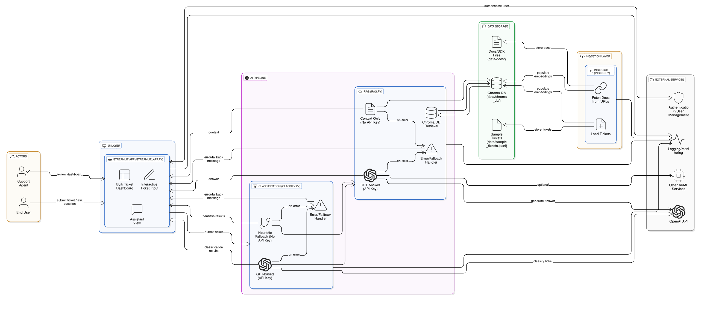

# Project: **Customer Support Copilot**
**Author:** Boddu Lakshmi Narayana Gupta (AI Engineer Intern)

---

## ✅ What I submitted
- **Streamlit app:** `app.py`- bulk dashboard + interactive assistant  
- **Ingest helper:** `ingest.py` - loads tickets + fetches docs from curated URLs  
- **Classification helper:** `classify.py` - topic, sentiment, priority, confidence; GPT-based if API key available, fallback to heuristics otherwise
- **RAG helper:** `rag.py` - retrieves answers using Chroma; GPT-based answer generation only if API key is provided 
- **Local DB:** `data/chroma_db/` - Chroma persistent storage
- **Sample tickets:** `data/sample_tickets.jsonl` - contains example support tickets
- **Tests:** `tests/` - unit tests for ingestion and classification
- **Requirements:** `requirements.txt` - lists all Python dependencies for the project 
- **Documentation:** [README.md](https://github.com/Gupta-4388/atlan-customer-support-copilot/blob/main/README.md), `submission.md`  
- **Deployment config:** `render.yaml` - configuration for Render deployment
- **Git ignore / env example:** `.gitignore`, `.env.example` - ignores sensitive files and provides a template for environment variables

---

## Project Links

- **🚀 Live Application:** https://atlan-customer-support-copilot.onrender.com
- **GitHub Repository:** https://github.com/Gupta-4388/atlan-customer-support-copilot

---

## 🏗️ System Architecture

The diagram below presents the end-to-end architecture of the Customer Support Copilot AI system. It shows how user interactions flow through the system, from ticket submission to AI-powered classification, retrieval, and assistance:

  

## How to run
- See [README.md](https://github.com/Gupta-4388/atlan-customer-support-copilot/blob/main/README.md) for detailed setup instructions.  

- Basic demo steps:

1. Ensure **Python 3.11+** is installed.  

2. Create a virtual environment and install dependencies:

```powershell
python -m venv venv
venv\Scripts\activate
pip install -r requirements.txt
```

3. Set up environment variables in `.env` (example in `.env.example`):

```env
OPENAI_API_KEY=your_key_here
OPENAI_CHAT_MODEL=gpt-4o-mini
CHROMA_DB_PATH=./data/chroma_db
```

4. Run ingestion (optional, only if DB is empty):

```powershell
python ingest.py
```

5. Launch the Streamlit app:

```powershell
streamlit run app.py
```

---

## Notes / Next Steps

* **API Flexibility:** The project works fully without an OpenAI API key (heuristics + retrieval only). With a key, GPT-based classification and answer generation are enabled for more accurate responses.  
* **Future improvements:** Refine UI/UX, integrate advanced classification models, expand SDK documentation for precise RAG responses.  
* **RAG answer note:** Answers are illustrative if relevant SDK docs are not present in `data/docs/`.  
* **Chroma DB path:** Ensure `./data/chroma_db/` exists and is writable for local persistence.  
* **Testing:** `tests/` folder includes basic unit tests to validate ingestion and classification logic.

---

## 📂 Project Structure (Summary)

```
atlan-customer-support-copilot/
├── app.py                   # Streamlit app (UI)
├── ingest.py                # Handles ticket/doc ingestion
├── classify.py              # Ticket classification logic (topic, sentiment, priority)
├── rag.py                   # RAG helper: answer_query using Chroma + GPT
├── data/
│   ├── chroma_db/           # Local Chroma DB persistence
│   ├── sample_tickets.jsonl # Example support tickets
│   └── docs/                # Optional SDK/docs files for RAG
├── tests/
│   ├── test_ingest.py       # Test ingestion works (mock URLs)
│   ├── test_classify.py     # Test classification logic
│   └── test_rag.py          # Test RAG query pipeline
├── .gitignore               # Ignore sensitive/auto-generated files
├── render.yaml              # Render deployment config
├── requirements.txt         # Dependencies
├── README.md                # Project documentation
└── submission.md            # Submission summary
```


